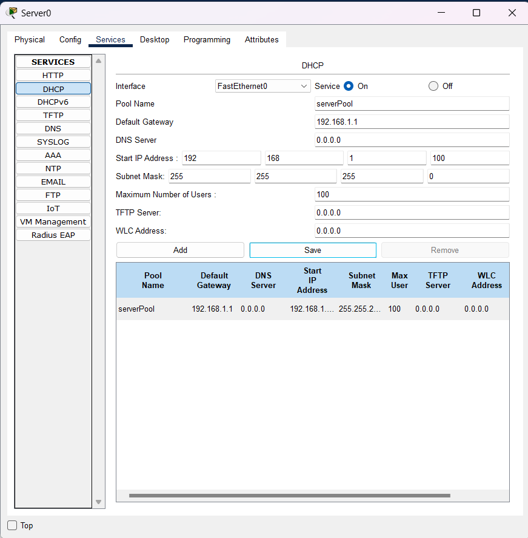
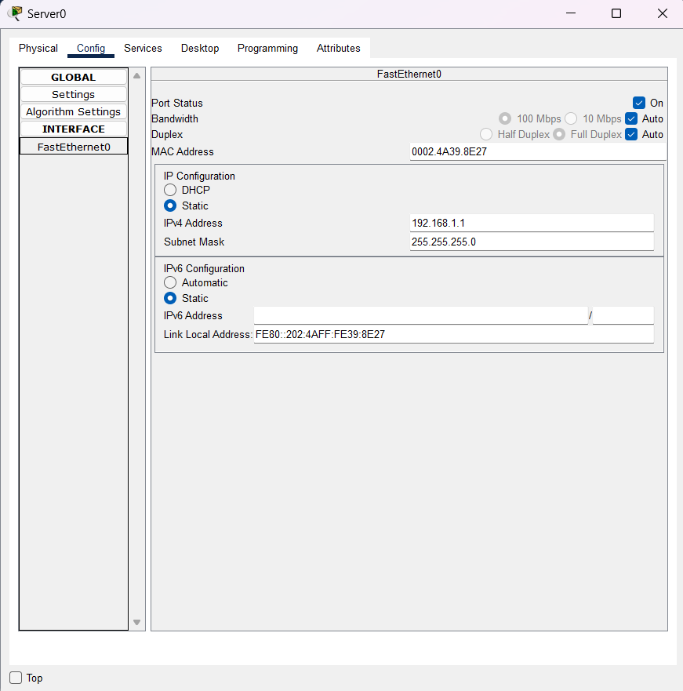
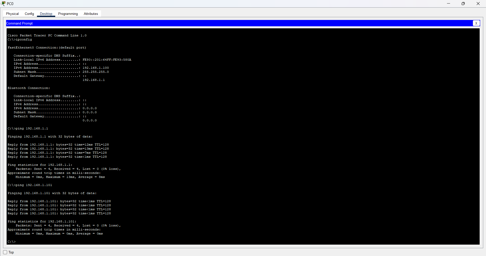
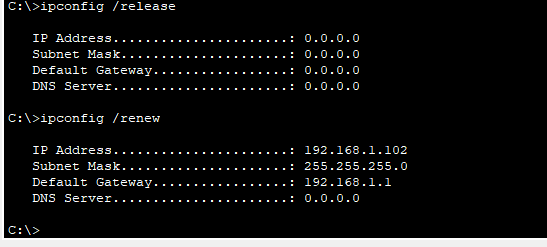

# TP2_Reseau
Travail pratique numéro 2 pour le cours de Réseau

## section 1
Configurer un réseau dans Packet Tracer qui contient
    - Un Home router
    - Deux PC's
    
1.	On configure la carte réseau d'un des poste de travail pour qu’elle reçoive une adresse dynamique.
	
    
3.	Dans une fenêtre de commandes, à l’aide de la commande nécessaire, on vérifie qu'on a reçu une adresse IP.
   
5.	On libére par la suite l’adresse reçue.
6.	On redemande un bail pour vérifier si tout est en ordre.
   

## section 2

## Question 0

## Question 1
Pour les adresses suivantes indiquez:

1. Leur classe;
2. la partie réseau et la partie hôte;
3. si ce sont des adresses privées ou publiques.

| Adresse IP      | Classe | Partie réseau | Partie hôte | Privée/Publique |
|-----------------|--------|---------------|-------------|-----------------|
| 192.168.1.1     | C      | 192.168.1     | 1           | Privée          |
| 172.16.254.1    | B      | 172.16        | 254.1       | Privée          |
| 10.0.0.1        | A      | 10            | 0.0.1       | Privée          |
| 203.0.113.45    | C      | 203.0.113     | 45          | Publique        |
| 169.254.123.78  | B      | 169.254       | 123.78      | Privée (APIPA)  |
| 8.8.8.8         | A      | 8             | 8.8.8       | Publique        |

## Question 2 
1.	Définir l’adresse de diffusion « broadcast ».
    - L’adresse de diffusion « broadcast » est la dernière adresse d’un sous-réseau qui permet de communiquer à tous les hôtes. En sorte, elle envoie son signal un peu partout.
2.	Quelle est l’opération effectuée sur une adresse pour déterminer l’adresse de réseau ?
    - Pour déterminer l’adresse réseau, on fait une opération ET Logique en binaire entre le masque et l’adresse IP.  
3.	Soit l’adresse IP 197.2.0.0. On souhaite définir 8 sous-réseaux.
    - 197.2.0.0 : Classe C, masque 255.255.255.0/24
    - 2^<mark>3</mark> = 8 (sous réseaux)
    - Masque décimal pointé : 24 + <mark>3</mark> = 27 bits à 1 : 11111111 11111111 11111111 11100000 --> 255.255.255.<mark>224</mark>
    - Notation CIDR : 27 bits à 1 --­> /27
    - Incrémentation : 256 - 224 = 32
      
| Sous-réseau | Adresse réseau |
|-------------|----------------|
| 1           | 197.2.0.0/27   |
| 2           | 197.2.0.32/27  |
| 3           | 197.2.0.64/27  |
| 4           | 197.2.0.96/27  |
| 5           | 197.2.0.128/27 |
| 6           | 197.2.0.160/27 |
| 7           | 197.2.0.192/27 |
| 8           | 197.2.0.224/27 |

## Question 3
Soit l'adresse IP suivante avec sa notation CIDR : 192.168.75.50/27.

1. L'adresse réseau est 192.168.75.0/27.
   <mark>Pour le trouver, nous avons fait le calcul de la manière suivante:</mark>
   -Tout d'abord, nous avons converti l'adresse ip 192.168.75.50/27 en binaire, ce qui donne exactement : <mark>11000000.10101000.01001011.00110010</mark>
   -Par la suite, nous devons comprendre le masque de sous-réseau qui est 27 en décimal, donc il faut mettre les 27 bits sur 32 à 1, donc : <mark>11111111.11111111.11111111.11100000</mark> (27 bits à 1 et 5 bits à 0).
   -Maintenant, on doit faire un ET logique entre l'adresse ip ==11000000.10101000.01001011.00110010== et le masque de sous-réseau en binaire <mark>11111111.11111111.11111111.11100000</mark>, ce qui égale 11000000.10101000.01001011.00100000 (ce qui correspond à 192.168.75.32).
   
2. L'adresse de diffusion est 192.168.75.63/27
   <mark>Pour l'adresse de diffusion, nous allons suivre un processus similaire :</mark>

	-Tout d'abord, nous partons de l'adresse réseau 192.168.75.32 que nous avons trouvée précédemment.
	-En binaire, l'adresse réseau est : <mark>11000000.10101000.01001011.00100000</mark>.
	-Le masque de sous-réseau reste le même : <mark>11111111.11111111.11111111.11100000</mark>.
	-Pour obtenir l'adresse de diffusion, nous devons mettre les 5 bits d'hôte à 1. Cela signifie que nous allons remplacer les 5 derniers bits de l'adresse réseau par des 1.
	-En effectuant cette opération, nous obtenons : <mark>11000000.10101000.01001011.00111111</mark>.
	-En décimal, cela correspond à 192.168.75.63/27
   
4. Nombre d'hôtes possibles (30) : Avec un masque de sous-réseau de /27, il faut prendre en compte qu'il reste 5 bits (32-27 = 5) et que
5 bits fait 32, il y a 32 donc adresses au total, mais on doit en soustraire 2 (une pour l'adresse réseau et une pour l'adresse de diffusion), ce qui laisse 30 adresses utilisables pour les hôtes.

